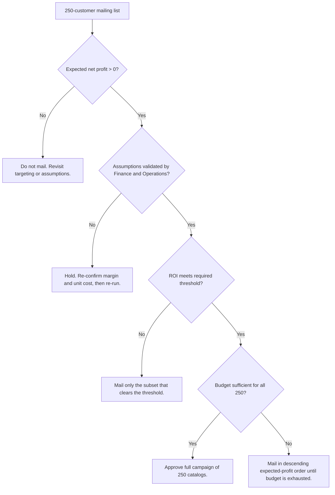

# Catalog Campaign Profitability & Customer Targeting Analysis


A decision-support project answering a direct marketing question end to end:
**should a company spend $1,625 mailing catalogs to 250 prospective customers,
and if the budget is cut, who should be mailed first?**

The repository combines a full **business analysis layer** (requirements,
stakeholders, KPIs, business rules, risk register, decision framework) with a
**reproducible analytics pipeline** (data quality, EDA, predictive model,
campaign economics, prioritisation, sensitivity analysis) and **BI-ready
outputs**.

---

## Executive Summary

A company sells through a direct-mail catalog channel alongside its retail
stores. Marketing has assembled a list of 250 prospective recipients. Each
catalog costs $6.50 to print and distribute, so the campaign commits $1,625
before a single order arrives. Historically the decision of whom to mail has
rested on segment intuition, which is neither auditable nor repeatable.

This project builds the decision on evidence instead. Using 2,375 historical
customers whose spending is already known, it establishes what kinds of customers
spend more, applies that pattern to the 250 prospects, weights each prediction by
the customer's probability of responding, and works through the campaign
economics from revenue to net profit to ROI.

The campaign is expected to generate **$47,224.87 in revenue** and **$23,612.44
in gross profit** against **$1,625 in cost**, for an **expected net profit of
$21,987.44** — a **13.5x return** on campaign spend. Every one of the 250
prospects is individually profitable, so no part of the list warrants exclusion.
Value is concentrated: the top quarter of the list carries 53% of the expected
profit, which matters if the budget is reduced.

The analysis also produces a finding beyond the immediate decision. Customer
value is driven by **relationship depth, not tenure**. A customer holding both a
loyalty membership and a store credit card is worth roughly seven times a
store-mailing-list customer, while loyalty membership on its own is associated
with *lower* spend. Long tenure has no measurable effect at all.

The recommendation is made conditional rather than absolute. It depends on
Finance confirming the margin assumption, Operations confirming the unit cost, and
response tracking being in place before mailing — and it carries two limitations
the analysis cannot resolve: the supplied response probabilities come from a
model that could not be inspected, and incrementality cannot be measured without
a control group.

---

## Business Problem

> The company must decide whether to spend **$1,625** mailing catalogs to **250
> prospective customers**, without knowing how much revenue those customers will
> generate. Campaign cost is committed and unrecoverable; revenue is uncertain
> and arises only from those who respond. Without an estimate of expected value
> per recipient, management cannot determine whether the campaign creates value,
> and cannot rank recipients if the budget is constrained.

| Known | Value |
|---|---|
| Customers on the mailing list | 250 |
| Cost per catalog (print and distribution) | $6.50 |
| Average gross margin | 50% |
| Historical customers available for modelling | 2,375 |

---

## Business Objective

Produce a defensible, repeatable estimate of the campaign's expected net profit
and ROI, and rank the 250 prospects by expected economic value so that budget can
be allocated to the highest-value recipients first — with every assumption stated
and every figure traceable to a formula.

---

## Key Business Questions

**Primary:** *Is the proposed catalog campaign financially attractive, and which
customers should receive the highest campaign priority?*

**Secondary:**

1. What customer characteristics are associated with higher average sales?
2. Which customer segments generate higher expected value?
3. What is the expected revenue from the 250-customer campaign?
4. What is the expected gross profit?
5. What is the campaign cost?
6. What is the expected net profit?
7. What is the expected ROI?
8. Which customers have the highest predicted economic value?
9. What assumptions could materially change the decision?
10. What should management monitor after campaign execution?

---

## Stakeholders

| Role | Interest | Influence | What they need from this analysis |
|---|---|---|---|
| Marketing Manager | Owns the campaign budget and the mail decision | High | Target list and expected return |
| Finance Manager | Validates margin, cost and ROI; signs off on spend | High | Assumption register and sensitivity analysis |
| Senior Management | Approves discretionary marketing spend | High | One-page recommendation |
| Sales / Customer Management | Owns the customer relationship | Medium | Segment targeting and contact-frequency controls |
| Marketing Operations | Executes print, mail file and distribution | Medium | Prioritised mail file and unit-cost confirmation |
| Data / Analytics | Builds and maintains the model | Medium | Methodology and monitoring plan |
| IT / Data Engineering | Provides data access | Low | Refresh requirements |

Full register with an influence/interest map:
[`docs/stakeholder_analysis.md`](docs/stakeholder_analysis.md).

---

## Data

Two files, both included in `data/raw/`.

| File | Rows | Role |
|---|---|---|
| `p1-customers.xlsx` | 2,375 | Historical customers with known average sale amount — model training |
| `p1-mailinglist.xlsx` | 250 | Campaign prospects — model scoring |

| Variable | Role |
|---|---|
| `Avg_Sale_Amount` | **Target** — average dollar value of a customer's purchases |
| `Avg_Num_Products_Purchased` | **Predictor** (numeric) |
| `Customer_Segment` | **Predictor** (categorical, 4 levels, one-hot encoded) |
| `Score_Yes` | **Response probability** supplied with the mailing list |
| `Years_as_Customer` | Tested and excluded — r = 0.03, inconsistent across files |
| `Responded_to_Last_Catalog` | Excluded — absent from the mailing list |
| `Customer_ID`, `Store_Number`, `ZIP` | Identifiers, excluded from modelling |
| `Name`, `Address`, `City`, `State` | Personally identifying, excluded |

Full field-level detail, including data-quality notes for every column:
[`docs/data_dictionary.md`](docs/data_dictionary.md).

---

## Methodology


| Stage | What happens | Artefact |
|---|---|---|
| Business understanding | Problem, objectives, stakeholders, requirements, KPIs | `docs/` |
| Data preparation | Load, standardise, validate; nothing silently imputed | `src/data_cleaning.py` |
| Exploratory analysis | What drives spend; is the campaign population comparable | `notebooks/01` |
| Predictive modelling | Linear regression on average sale amount | `notebooks/02` |
| Profitability analysis | Revenue, gross profit, cost, net profit, ROI | `notebooks/03` |
| Customer prioritisation | Rank and tier by expected economic value | `notebooks/03` |
| Sensitivity analysis | 80 scenarios plus break-even points | `notebooks/04` |
| Business recommendation | Conditional recommendation and monitoring plan | `reports/` |

### Decision flow



---

## Key Findings

All figures below were computed by the code in this repository from the two
supplied datasets. The three headline figures also appear in the source project
*Predicting Catalog Demand*; because the underlying data was available here, they
were **independently recomputed rather than quoted**, and reproduce to within
rounding.

**1. The campaign is strongly profitable.** Expected net profit of $21,987.44 on
$1,625 of spend — a 13.5x return. The average catalog costs $6.50 and is expected
to generate $188.90 in revenue.

**2. Every prospect pays for itself.** At the average response probability, a
catalog breaks even at a $38.16 predicted sale. The lowest predicted sale on the
list is $125.02. No name on this list destroys value.

**3. Value is concentrated.** The top 63 prospects (25%) carry 53% of the
expected profit. If the budget were halved, mailing the top 125 names would retain
roughly three-quarters of the profit at half the cost.

**4. Relationship depth drives value; tenure does not.**

| Segment | Mean sale (historical) | Campaign ROI |
|---|---|---|
| Loyalty Club and Credit Card | $1,074 | 27.2x |
| Credit Card Only | $683 | 16.9x |
| Loyalty Club Only | $396 | 9.9x |
| Store Mailing List | $157 | 4.1x |

Years as a customer correlates at just **0.03** with average sale amount.
Loyalty membership *on its own* is associated with $149 **less** per sale than a
credit-card-only customer — it is the combination that matters.

**5. Past responders are the wrong target.** Customers who responded to the last
catalog spend **less** on average ($156) than those who did not ($419). The effect
is confounding: prior response concentrates in the lowest-spending segment.
Targeting on past response alone would systematically select the least valuable
customers.

**6. Ranking on either input alone would be wrong.** Response probability is flat
across segments (33.7% to 35.9%), while predicted spend varies sevenfold. A
prospect with a $2,000 predicted sale at 18% response probability is worth less
than one with an $800 sale at 70%. Only the product of the two identifies the
right targets.

**7. The decision is robust.** All 80 tested scenarios are profitable. Response
would have to collapse to a **2.3% response rate** — roughly one order per 43
catalogs — before the campaign merely broke even.

---

## Financial Analysis

| Measure | Value | Formula |
|---|---|---|
| Sum of predicted sale amounts | $138,292.13 | Σ predicted sale amount |
| Average response probability | 34.1% | mean(`Score_Yes`) |
| **Expected revenue** | **$47,224.87** | Σ (predicted sale × P(response)) |
| **Gross profit** | **$23,612.44** | Expected revenue × 50% |
| **Campaign cost** | **$1,625.00** | 250 × $6.50 |
| **Expected net profit** | **$21,987.44** | Gross profit − campaign cost |
| **ROI** | **13.53x (1,353%)** | Net profit ÷ campaign cost |
| Revenue per customer mailed | $188.90 | Expected revenue ÷ 250 |
| Net profit per customer mailed | $87.95 | Net profit ÷ 250 |

### Break-even points

| Assumption | Base case | Break-even | Headroom |
|---|---|---|---|
| Response level | 100% of modelled | 6.9% | Response can fall 93% |
| Campaign response rate | 34.1% | ~2.3% | About 1 order per 43 catalogs |
| Gross margin | 50% | ~3.4% | Can fall 46 points |
| Cost per catalog | $6.50 | ~$94.45 | Can rise 14x |

### Downside scenarios

| Scenario | Response | Margin | Cost | Net profit | ROI |
|---|---|---|---|---|---|
| Best case | 120% | 60% | $5.00 | $32,284 | 25.8x |
| **Base case** | **100%** | **50%** | **$6.50** | **$21,987** | **13.5x** |
| Mild downside | 80% | 45% | $8.00 | $15,001 | 7.5x |
| Severe downside | 60% | 40% | $10.00 | $8,834 | 3.5x |

*Scenario rows other than the base case are hypothetical and must not be quoted
as forecasts.*

---

## Model Performance

```
Predicted Average Sale Amount =
      $303.46                                        (intercept)
    + $66.98  ×  Average Number of Products Purchased
    + $281.84  if  Loyalty Club and Credit Card
    - $149.36  if  Loyalty Club Only
    - $245.42  if  Store Mailing List
    +   $0.00  if  Credit Card Only                  (reference level)
```

| Metric | Fitted (n=2,375) | Held-out test (n=594) |
|---|---|---|
| R² | 0.8369 | 0.8316 |
| MAE | $93.07 | $93.40 |
| RMSE | $137.34 | $140.19 |

5-fold cross-validated R²: **0.8351 (std 0.0145)**.

### What R² = 0.84 actually means

> The model explains approximately **84% of the variation** in average sale
> amount across the customers evaluated.

**It is not an accuracy rate.** It does not mean predictions are correct 84% of
the time, nor that individual predictions fall within 16% of the truth. R² is a
measure of *explained variance* — it compares the model's errors against the
errors you would make by predicting the overall mean for everyone. A model can
explain most of the variance and still be meaningfully wrong about any individual
customer.

The figure that describes individual reliability is **MAE: about $93** on a mean
predicted sale of $553, roughly 17% in either direction. The campaign forecast is
a *sum across 250 customers*, not 250 individual promises, so opposing errors
largely offset — which is why the total is far more reliable than any single
prediction.

### Model selection

| Model | Test R² | Test MAE |
|---|---|---|
| **Linear Regression (selected)** | 0.832 | $93.40 |
| Decision Tree (depth 5) | 0.879 | $79.13 |
| Random Forest (200 trees) | 0.879 | $78.76 |

The flexible models genuinely perform better, and that is reported rather than
buried. **Linear regression was retained anyway**: the improvement is worth about
$1,875 of gross profit against an expected net profit of $21,987 — smaller than
the swing from a five-point change in the margin assumption — and the
interpretability feeds list-building and segment strategy in a way a
feature-importance score does not. This trade-off should be revisited if the model
moves into automated per-customer targeting at scale.

---

## Business Recommendation

**Proceed with the campaign and mail all 250 catalogs**, conditional on three
confirmations before budget release:

| # | Condition | Owner |
|---|---|---|
| 1 | Confirm the blended gross margin on the catalog product mix is close to 50% | Finance Manager |
| 2 | Confirm the current print and distribution cost is still $6.50 per unit | Marketing Operations |
| 3 | **Agree response attribution and the measurement window before mailing** | Marketing Operations |

Condition 3 is a hard gate. Without attribution the campaign may well make money,
but the organisation will learn nothing from it and the next decision will be made
just as blind as this one.

**If the budget is cut**, mail in descending expected-profit order using
`outputs/customer_scores.csv`. Cut from the bottom of the ranking, never by
segment convenience.

**The highest-return action available is not optimising this campaign.** It is
growing the dual-relationship segment, which returns 27.2x against 4.1x for
store-list customers.

Full detail: [`docs/recommendations.md`](docs/recommendations.md) and
[`docs/decision_framework.md`](docs/decision_framework.md).

---

## Risks and Limitations

### Risks

Twelve risks are registered in [`docs/risks_and_mitigations.md`](docs/risks_and_mitigations.md).
The three with greatest exposure:

| Risk | Why it matters |
|---|---|
| **Response probabilities are wrong** | `Score_Yes` drives half the revenue calculation and comes from a model that is not supplied and cannot be validated here |
| **Non-incremental revenue** | Some orders may have occurred without the catalog. The only risk capable of reversing the conclusion, and untestable without a control group |
| **Insufficient tracking** | Entirely preventable. If attribution is not agreed before mailing, nothing is learned regardless of performance |

### Limitations

1. Only two predictors were available; about 16% of the variation in spend is unexplained by anything in the data.
2. The response model is a black box.
3. Incrementality cannot be measured — no control group exists in this design.
4. The model under-predicts high-value customers, making the forecast conservative at the top.
5. The mailing list skews towards segments that are a smaller share of the training data.
6. Coefficients are associations, not causal levers.
7. Products purchased and sale amount are both averages over the same history, so part of the fit is arithmetic.
8. No timestamps exist, so drift cannot be assessed against elapsed time.
9. Single geography — findings should not be generalised to other markets.
10. Single-campaign horizon; no customer lifetime value is modelled.

**What this project does not claim.** It was not deployed to production. It did
not run against a live campaign. No business outcome was realised, because the
campaign described here has not been executed. Every figure is a forecast produced
from the supplied historical data, conditional on stated assumptions.

---

## Dashboard

A four-page executive dashboard is **specified** in
[`dashboard/dashboard_requirements.md`](dashboard/dashboard_requirements.md),
with the CSV extracts needed to build it produced in `outputs/`. **No dashboard
file or screenshot is included** — the specification and the data are what this
repository provides.

| Page | Audience | Contents |
|---|---|---|
| Executive Overview | Senior Management | Six KPI cards, profit by segment, revenue-to-profit waterfall, Management Decision panel |
| Customer Targeting | Marketing Manager | Priority tiers, ranked prospect table, value map, cumulative profit curve |
| Scenario Analysis | Finance Manager | Margin/cost heatmap, response scenarios, tornado chart, break-even cards |
| Post-Campaign Performance | All | Actual versus forecast on every monitoring KPI (populated after launch) |

Every scenario visual carries a mandatory "hypothetical" label so downside
figures are never quoted as forecasts. Field-level schema and aggregation rules:
[`dashboard/dashboard_data_dictionary.md`](dashboard/dashboard_data_dictionary.md).

---

## Repository Structure

```
catalog-campaign-profitability-analysis/
├── README.md
├── PORTFOLIO_QUALITY_CHECKLIST.md     Verification pass, honesty register
├── LICENSE
├── .gitignore
├── requirements.txt
├── pytest.ini
├── run_analysis.py                     End-to-end pipeline, one command
│
├── data/
│   ├── README.md                       Data provenance and refresh notes
│   ├── raw/                            Source files (both included)
│   └── processed/                      Cleaned and scored intermediates
│
├── notebooks/
│   ├── 01_exploratory_data_analysis.ipynb    Data quality and value drivers
│   ├── 02_predictive_model.ipynb             Model build, validation, benchmark
│   ├── 03_campaign_profitability.ipynb       Campaign economics, prioritisation
│   └── 04_sensitivity_analysis.ipynb         80 scenarios, break-even, tornado
│
├── src/
│   ├── __init__.py
│   ├── data_cleaning.py                Loading, standardising, quality checks
│   ├── feature_engineering.py          Encoding and design matrix
│   ├── modeling.py                     Training, validation, scoring
│   ├── profitability.py                All financial formulas, defined once
│   └── evaluation.py                   Metrics and honest R² interpretation
│
├── docs/
│   ├── business_case.md                Situation, options, cost of inaction
│   ├── stakeholder_analysis.md         Register, influence map, comms plan
│   ├── business_requirements.md        BR-001 to BR-015 with traceability
│   ├── functional_requirements.md      FR-001 to FR-020 and NFRs
│   ├── data_dictionary.md              Every field, role and quality note
│   ├── kpi_framework.md                Forecast and monitoring KPIs
│   ├── business_rules.md               BRule-01 to BRule-14
│   ├── assumptions_and_constraints.md  A-01 to A-10, C-01 to C-10
│   ├── data_quality.md                 Findings with the code that produced them
│   ├── decision_framework.md           The decision rule and what would change it
│   ├── risks_and_mitigations.md        R-01 to R-12 with owners
│   ├── recommendations.md              Primary and supporting recommendations
│   ├── implementation_plan.md          Eight phases with RACI
│   ├── resume_project_entry.md         Résumé, LinkedIn and interview framings
│   └── interview_questions.md          20 questions with answers
│
├── dashboard/
│   ├── dashboard_requirements.md       Four-page specification
│   └── dashboard_data_dictionary.md    Extract schema and aggregation rules
│
├── reports/
│   ├── executive_summary.md            For a non-technical Marketing Director
│   └── project_report.md               Full 20-section analysis
│
├── outputs/                            Generated CSV extracts
│
└── tests/
    ├── test_profitability.py           Financial formulas and edge cases
    └── test_data_cleaning.py           Cleaning, quality checks, encoding
```

---

## How to Run

```bash
# 1. Clone
git clone https://github.com/<your-username>/catalog-campaign-profitability-analysis.git
cd catalog-campaign-profitability-analysis

# 2. Create a virtual environment
python -m venv .venv
source .venv/bin/activate          # Windows: .venv\Scripts\activate

# 3. Install dependencies
pip install -r requirements.txt

# 4. Run the full pipeline (writes every CSV to outputs/)
python run_analysis.py

# 5. Run the test suite
pytest -q

# 6. Explore the notebooks
jupyter notebook notebooks/
```

**Expected output from step 4:**

```
outputs/customer_scores.csv          250 prospects, scored, ranked and tiered
outputs/campaign_summary.csv         Campaign-level KPI totals
outputs/segment_summary.csv          Economics by customer segment
outputs/priority_summary.csv         Economics by priority tier
outputs/sensitivity_analysis.csv     80 assumption scenarios
outputs/analysis_facts.json          Every computed figure, for verification
```

**Expected output from step 5:** `77 passed`.

Requires Python 3.10 or later. Both source data files are included in
`data/raw/`, so the pipeline runs immediately after install.

---

## Skills Demonstrated

### Business Analysis

- **Business problem definition** — translating "should we mail these catalogs" into a testable financial question with stated decision criteria
- **Requirements analysis** — 15 business and 20 functional requirements, each traced to the artefact that satisfies it and to an acceptance criterion
- **Stakeholder analysis** — register, influence/interest mapping, and a communication plan matched to what each role actually needs
- **KPI definition** — forecast and post-launch KPI sets with formulas, owners, data sources and decision relevance
- **Decision analysis** — decision rule defined *before* results, with explicit break-even points and scenarios that would reverse it
- **Risk analysis** — 12-risk register with impact, likelihood, mitigation and owner, plus an explicit out-of-scope list
- **Business rules** — 14 documented rules governing the analysis, enforced in code and tested
- **Process thinking** — eight-phase implementation plan with RACI and a hard go/no-go gate on measurability

### Analytics

- **Python** — modular package with typed signatures, validation and docstrings
- **pandas / NumPy** — cleaning, aggregation, reshaping, scenario grids
- **Matplotlib / Seaborn** — purpose-built visuals, each answering a stated business question
- **scikit-learn** — linear regression, train/test split, cross-validation, model benchmarking
- **Statistical analysis** — correlation, confidence intervals, residual diagnostics, outlier treatment, confounding identification
- **Predictive modelling** — feature selection driven by business rules, categorical encoding with a fixed reference level, honest generalisation testing
- **Financial modelling** — expected value, gross margin, ROI, break-even analysis
- **Sensitivity analysis** — 80-scenario grid, tornado chart, combined-downside testing
- **Testing** — 77 pytest tests covering financial formulas, cleaning logic, encoding and edge cases

### Business Intelligence

- **Power BI-ready outputs** — five documented CSV extracts with defined grain and relationships
- **Dashboard design** — four-page specification with audience-matched pages, DAX-equivalent measures and design standards
- **KPI reporting** — aggregation rules documented per field to prevent common BI errors such as summing ROI or averaging identifiers

---

## Source and Honesty Notes

This project modernises an earlier analysis titled *Predicting Catalog Demand*
(2017). The business problem, the $6.50 catalog cost and 50% gross-margin
assumptions, the choice of target variable and the linear-regression methodology
are carried forward from that source. The business analysis layer, validation
approach, prioritisation framework, sensitivity analysis, dashboard specification,
test suite and code structure are new.

The source project reported predicted average sales of $138,292.13, predicted
revenue of $47,224.87 and predicted profit of $21,987.44. Because the underlying
datasets were available, **all three were independently recomputed by the code in
this repository and reproduce to within rounding** — they are reported here as
verified results rather than inherited claims.

**What this project does not claim:** no production deployment, no live campaign
execution, no realised business outcome, no fabricated metrics, no invented
company names or employment context. Every number is either computed from the
supplied data or explicitly labelled as an assumption or a hypothetical scenario.

---

## Further Reading

| Start here if you are | Read |
|---|---|
| A hiring manager with two minutes | [`reports/executive_summary.md`](reports/executive_summary.md) |
| Assessing business analysis skills | [`docs/business_requirements.md`](docs/business_requirements.md), [`docs/decision_framework.md`](docs/decision_framework.md), [`docs/risks_and_mitigations.md`](docs/risks_and_mitigations.md) |
| Assessing analytics skills | [`notebooks/02_predictive_model.ipynb`](notebooks/02_predictive_model.ipynb), [`notebooks/04_sensitivity_analysis.ipynb`](notebooks/04_sensitivity_analysis.ipynb) |
| Assessing code quality | [`src/profitability.py`](src/profitability.py), [`tests/`](tests/) |
| Reading the whole thing | [`reports/project_report.md`](reports/project_report.md) |

---

## License

MIT — see [`LICENSE`](LICENSE).
