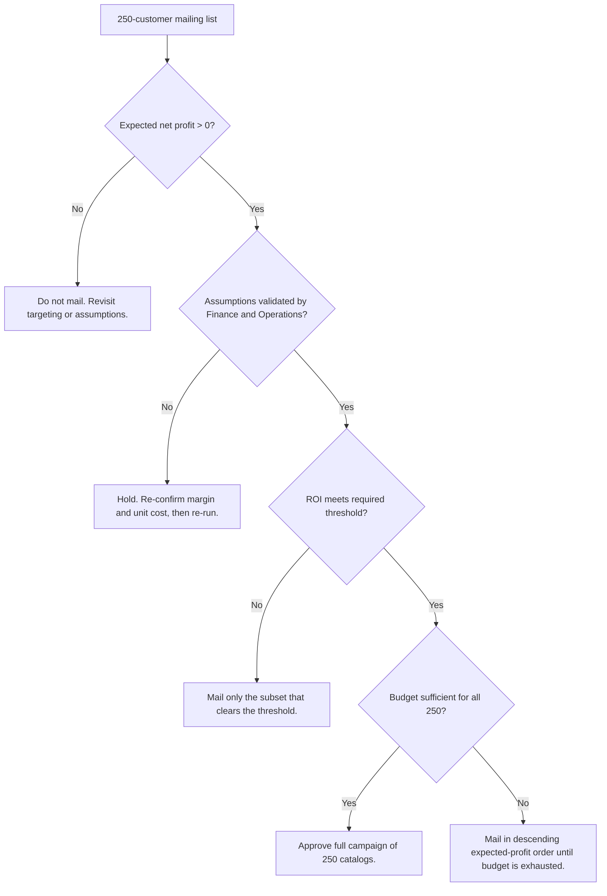

# Business Decision Framework

## Purpose

To state, before seeing the numbers, the conditions under which the campaign
should be approved. Defining the test first prevents the analysis from being
reverse-engineered to justify a decision already taken.

## The decision rule

The campaign is considered **financially viable** when all three conditions hold:

```
IF   Expected Net Profit > 0
AND  the assumptions in docs/assumptions_and_constraints.md remain valid
AND  Campaign ROI >= the organisation's required threshold
THEN the campaign is financially viable and should proceed.
```



## Condition 1 — Expected net profit above zero

| Measure | Value |
|---|---|
| Expected revenue | $47,224.87 |
| Gross profit at 50% margin | $23,612.44 |
| Campaign cost (250 x $6.50) | $1,625.00 |
| **Expected net profit** | **$21,987.44** |

**Condition met.** Every one of the 250 prospects also carries a positive
expected net profit individually, ranging from $5.79 to $396.16. There is no
subset of the list that destroys value on the base-case assumptions.

## Condition 2 — Assumptions remain valid

Two assumptions carry high impact and require sign-off before mailing:

| Assumption | Owner | Status |
|---|---|---|
| A-02: 50% gross margin | Finance Manager | **Requires confirmation.** Gross profit scales linearly with this figure. |
| A-05: `Score_Yes` is a valid response probability | Data / Analytics | **Cannot be validated in this project.** The underlying model is not supplied. Stress-tested instead. |
| A-01: $6.50 per catalog | Marketing Operations | **Requires confirmation** against the current supplier quote. |

**Condition conditionally met.** The recommendation is explicitly contingent on
these three confirmations.

## Condition 3 — ROI threshold

> **Example assumption, not a company standard.** No required ROI threshold was
> supplied with this project. The figure below is used purely to demonstrate how
> the test operates. The actual threshold must come from Finance.

Taking an illustrative hurdle of **3.0x (300%)** on marketing spend:

| Measure | Value |
|---|---|
| Campaign ROI | 13.53x (1,353%) |
| Illustrative threshold | 3.0x |
| Margin above the illustrative threshold | 10.53x |

**Condition met against the illustrative threshold.** Under the most pessimistic
scenario tested — response at 60% of modelled, a 40% gross margin and $10 per
catalog — ROI is still 3.53x, which clears the illustrative hurdle. The decision
is therefore not sensitive to the choice of threshold across any plausible range.

## Decision outcome

All three conditions are satisfied. The recommendation is to **approve the
campaign**, subject to the assumption confirmations in Condition 2.

## Scenarios that would change the decision

| Scenario | Effect on the model | Effect on the decision |
|---|---|---|
| **Lower response rate.** Actual response falls below the modelled level. | Expected revenue scales down proportionally. | The decision holds until response falls to roughly **6.9% of the modelled level** — about a 2.3% campaign response rate. At 60% of modelled response, net profit is still $12,542. This is the single largest source of uncertainty but also the one with the most headroom. |
| **Lower average order value.** Responders spend less than their historical average (A-03 fails). | Predicted sale amounts are biased upward; revenue falls proportionally. | Mathematically equivalent to a response shortfall. Average sale amount across the list would have to fall from $553 to about **$38** before the campaign breaks even. |
| **Higher catalog cost.** Print or postage rises above $6.50. | Campaign cost rises; gross profit unchanged. | Low sensitivity. At $10 per catalog net profit is $21,112 — a 4% reduction. Cost would have to reach about **$94 per catalog** to break even. |
| **Lower gross margin.** The blended margin is below 50%. | Gross profit scales linearly with margin. | The highest-leverage financial assumption. At a 40% margin net profit falls to $17,265, a 21% reduction. Margin would have to fall below roughly **3.4%** to break even. |
| **Model prediction error.** Predictions are systematically off. | Held-out mean absolute error is $93.40 per customer. In the worst case where every prediction errs in the same direction, campaign gross profit moves by about **$11,675**. | Net profit remains positive even under that deliberately pessimistic framing. Errors in practice partially offset, so the realistic band is materially narrower. |
| **Combined downside.** Response at 60%, margin at 40%, cost at $10. | All three adverse moves at once. | Net profit **$8,834**, ROI 3.53x. The campaign remains profitable. |
| **Non-incrementality.** A large share of orders would have occurred without the catalog (A-08 fails). | True incremental profit is lower than forecast by that share. | **This is the scenario that could genuinely reverse the decision** and the one this analysis cannot test. It can only be measured with a randomised holdout group, which the current campaign design does not include. |

## What this framework cannot decide

- Whether the catalog channel is the best use of the marketing budget overall.
  This analysis evaluates one campaign against doing nothing, not against
  alternative channels.
- Whether the orders are incremental (A-08). Without a control group, gross
  performance is measurable but true causal lift is not.
- Whether contacting these customers carries a relationship cost that exceeds
  the modelled profit. See risk R-08.
