# Implementation Plan

Applies if management approves the campaign. Durations are indicative planning
estimates, not commitments, and should be replaced with the organisation's
actual operational lead times.

```mermaid
gantt
    title Catalog campaign execution
    dateFormat X
    axisFormat Week %s
    section Preparation
    Data preparation        :a1, 0, 1w
    Customer selection      :a2, after a1, 1w
    Campaign preparation    :a3, after a2, 2w
    section Execution
    Catalog distribution    :a4, after a3, 1w
    Response tracking       :a5, after a4, 6w
    section Learning
    Financial measurement   :a6, after a5, 1w
    Model evaluation        :a7, after a6, 1w
    Future optimisation     :a8, after a7, 2w
```

## Phase 1 — Data preparation

**Objective.** Produce a validated, current dataset for scoring.

| Activity | Responsible |
|---|---|
| Extract a current customer file and the mailing list with a snapshot date | IT / Data Engineering |
| Run the automated data-quality checks and review the findings | Data / Analytics |
| Confirm segment definitions are unchanged since the last extract | Data / Analytics, Sales / Customer Management |
| Deduplicate the mail file on address to avoid duplicate household mailings (A-10) | Marketing Operations |
| Verify address deliverability | Marketing Operations |

**Exit criteria.** Quality checks pass with no unexpected segment levels, no
missing values in the predictor fields and no out-of-range response scores.

## Phase 2 — Customer selection

**Objective.** Produce the final, ranked mail file.

| Activity | Responsible |
|---|---|
| Score all prospects with the model and compute per-customer economics | Data / Analytics |
| Assign priority tiers using the documented rule (BRule-08) | Data / Analytics |
| Apply contact-frequency caps and suppression lists | Marketing Operations |
| Review the segment mix and flag any customer who should not be contacted | Sales / Customer Management |
| Approve the final catalog count and the associated budget | Marketing Manager, Finance Manager |

**Exit criteria.** A signed-off mail file with every record carrying a predicted
sale amount, an expected net profit, a rank and a priority tier.

## Phase 3 — Campaign preparation

**Objective.** Ensure the campaign can be measured before it is sent.

| Activity | Responsible |
|---|---|
| **Agree the response-attribution mechanism** — campaign code, unique offer code or matched-back customer ID | Marketing Operations, Data / Analytics |
| **Define the response measurement window** and the rule for attributing late orders | Marketing Manager, Finance Manager |
| Confirm the final per-unit print and distribution cost against a supplier quote (A-01) | Marketing Operations |
| Confirm the blended gross margin on the catalog product mix (A-02) | Finance Manager |
| Set up the reporting extract and dashboard refresh | Data / Analytics |

**Exit criteria.** Attribution mechanism tested end to end on a sample order.
**This is a go/no-go gate.** Without it the campaign cannot be measured and
risk R-09 materialises in full.

## Phase 4 — Catalog distribution

**Objective.** Deliver catalogs to the approved list.

| Activity | Responsible |
|---|---|
| Release the mail file to the print and fulfilment supplier | Marketing Operations |
| Execute print and mailing | Marketing Operations |
| Record the actual number mailed and the actual invoiced cost | Marketing Operations, Finance Manager |
| Log undeliverables and returns | Marketing Operations |

**Exit criteria.** Confirmed mailed volume and confirmed actual cost, both
recorded against the forecast.

## Phase 5 — Response tracking

**Objective.** Capture responses accurately throughout the measurement window.

| Activity | Responsible |
|---|---|
| Capture orders attributed to the campaign | Marketing Operations |
| Report weekly actual response rate against the 34.1% forecast (M-01) | Data / Analytics |
| Report actual average order value against the $553.17 predicted mean (M-02) | Data / Analytics |
| Monitor opt-out and complaint rates (M-11) | Sales / Customer Management |
| Escalate if response tracks materially below forecast at the midpoint | Marketing Manager |

**Exit criteria.** Measurement window closed and the response dataset frozen.

## Phase 6 — Financial performance measurement

**Objective.** Establish what the campaign actually delivered.

| Activity | Responsible |
|---|---|
| Reconcile actual campaign revenue (M-03) | Finance Manager |
| Reconcile actual campaign cost against invoices (M-04) | Finance Manager |
| Calculate realised gross margin (M-05) and actual net profit (M-06) | Finance Manager |
| Calculate actual ROI (M-07) and compare against the 13.53x forecast | Marketing Manager |
| Report performance by segment (M-10) and by priority tier (M-09) | Data / Analytics |

**Exit criteria.** A signed financial reconciliation of forecast against actual.

## Phase 7 — Model evaluation

**Objective.** Establish whether the model and its assumptions held.

| Activity | Responsible |
|---|---|
| Compare predicted against actual sale amounts for responders; recompute MAE (M-08) | Data / Analytics |
| Test whether the High tier outperformed the Medium tier on response and profit | Data / Analytics |
| Test each assumption against what actually happened and update the register | Data / Analytics, Finance Manager |
| Re-estimate the model on post-campaign data and compare coefficients | Data / Analytics |
| Document what the model got wrong and why | Data / Analytics |

**Exit criteria.** An updated assumptions register and a model performance note.

**Note.** If the High tier does not outperform the Medium tier, the
prioritisation adds no value and the ranking approach must be reconsidered.
That is the sharpest single test of whether this analysis was worth doing.

## Phase 8 — Future campaign optimisation

**Objective.** Convert one campaign into a repeatable capability.

| Activity | Responsible |
|---|---|
| Build a randomised holdout group into the next campaign to measure incrementality (R4) | Marketing Manager, Data / Analytics |
| Obtain documentation for the response-scoring model (R5) | Data / Analytics |
| Add the campaign's actual outcomes to the training data | Data / Analytics |
| Test whether tenure, recency or product mix improve prediction once defined consistently (R8) | Data / Analytics |
| Review contact-frequency policy against observed opt-out rates (R6) | Sales / Customer Management |
| Refresh the KPI targets using realised rather than forecast performance | Marketing Manager, Finance Manager |

**Exit criteria.** A scoring pipeline and a KPI baseline ready for the next
campaign cycle.

## RACI summary

| Phase | Responsible | Accountable | Consulted | Informed |
|---|---|---|---|---|
| 1. Data preparation | Data / Analytics | Data / Analytics | IT, Marketing Operations | Marketing Manager |
| 2. Customer selection | Data / Analytics | Marketing Manager | Sales / Customer Management, Finance | Senior Management |
| 3. Campaign preparation | Marketing Operations | Marketing Manager | Finance, Data / Analytics | Senior Management |
| 4. Distribution | Marketing Operations | Marketing Operations | Finance | Marketing Manager |
| 5. Response tracking | Marketing Operations | Marketing Manager | Data / Analytics | Finance |
| 6. Financial measurement | Finance Manager | Finance Manager | Marketing Manager | Senior Management |
| 7. Model evaluation | Data / Analytics | Data / Analytics | Finance, Marketing | Marketing Manager |
| 8. Optimisation | Data / Analytics | Marketing Manager | All | Senior Management |
