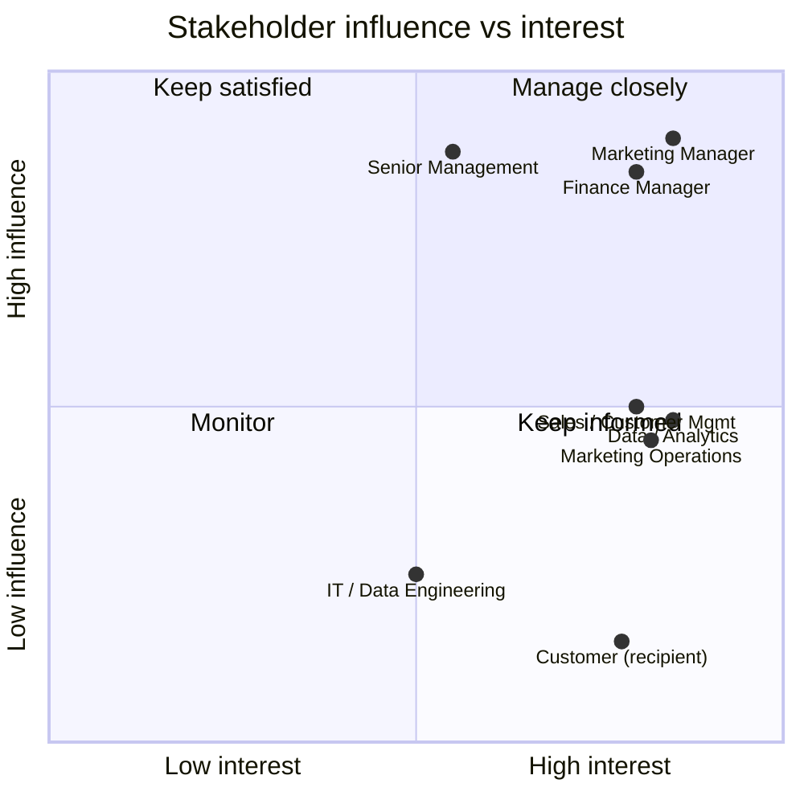

# Stakeholder Analysis

Roles are described generically. No real company, department or individual is named.

## Stakeholder register

| ID | Stakeholder role | Interest in the outcome | Influence | Interest | Engagement approach |
|---|---|---|---|---|---|
| ST-01 | Marketing Manager | Owns the campaign budget and the decision to mail. Needs the target list and the expected return. | High | High | Manage closely. Primary recipient of the executive summary and the dashboard. |
| ST-02 | Finance Manager | Validates the gross-margin assumption, the cost per catalog and the ROI calculation. Signs off on spend. | High | High | Manage closely. Reviews the assumptions register and the sensitivity analysis. |
| ST-03 | Senior Management | Approves discretionary marketing spend and expects the decision to be defensible. | High | Medium | Keep satisfied. One-page executive summary and the recommendation only. |
| ST-04 | Sales / Customer Management | Owns the customer relationship; absorbs the consequences of over- or under-targeting. | Medium | High | Keep informed. Consulted on segment-level targeting and contact frequency. |
| ST-05 | Marketing Operations | Executes print, mail-file preparation and distribution. Owns actual per-unit cost. | Medium | High | Keep informed. Confirms the $6.50 unit cost and the response-tracking mechanism. |
| ST-06 | Data / Analytics function | Builds and maintains the model, the scoring pipeline and the reporting extract. | Medium | High | Collaborate. Owns model monitoring and refresh. |
| ST-07 | IT / Data Engineering | Provides access to the customer and transaction data used for scoring. | Low | Medium | Keep informed. Consulted on data availability and refresh cadence. |
| ST-08 | Customer (recipient) | Receives the catalog. Not a decision maker but the source of all campaign value. | Low | High | Represented indirectly through contact-frequency and over-targeting risk controls. |

## Influence / interest positioning

## What each stakeholder needs from this analysis

| Stakeholder | Key question they are asking | Where it is answered |
|---|---|---|
| Marketing Manager | Should we mail, and to whom first? | `reports/executive_summary.md`, `outputs/customer_scores.csv` |
| Finance Manager | Are the margin and cost assumptions sound, and what is the downside? | `docs/assumptions_and_constraints.md`, `notebooks/04_sensitivity_analysis.ipynb` |
| Senior Management | Is the expected return worth the spend? | `reports/executive_summary.md` |
| Sales / Customer Management | Which segments are we leaning on, and are we over-contacting anyone? | `outputs/segment_summary.csv`, `docs/risks_and_mitigations.md` (R-08) |
| Marketing Operations | How many catalogs, to which addresses, by when? | `docs/implementation_plan.md` |
| Data / Analytics | How was the model built and how will we know it has degraded? | `notebooks/02_predictive_model.ipynb`, `docs/kpi_framework.md` |

## Communication plan

| Audience | Artefact | Format | Cadence |
|---|---|---|---|
| Senior Management | Executive summary and recommendation | 1-page memo | Once, pre-approval |
| Marketing Manager, Finance Manager | Full project report and sensitivity analysis | Report plus dashboard | Once pre-approval, then monthly post-launch |
| Marketing Operations | Prioritised mail file | CSV extract | Once, at campaign preparation |
| Marketing and Finance | Actual vs forecast performance | Dashboard | Weekly during the response window |
| Data / Analytics | Model performance review | Notebook refresh | After campaign close |
