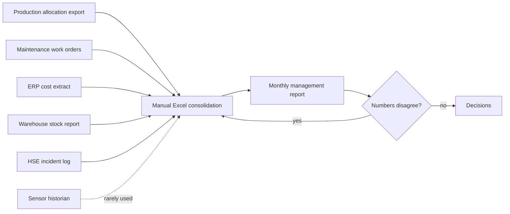
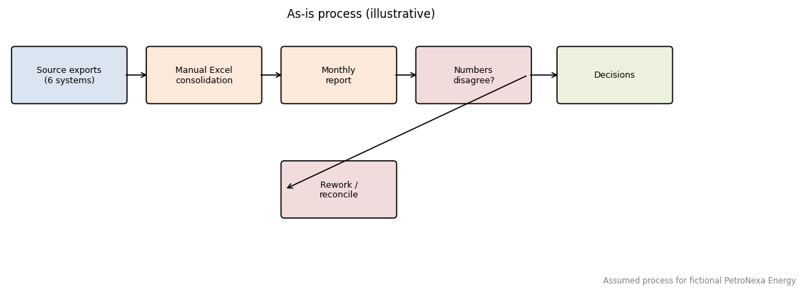

# Business Process - As Is (assumed)

> All operational data in this project are synthetic. PetroNexa Energy is a FICTIONAL company; stakeholders and roles are illustrative assumptions.

Because PetroNexa is fictional, the as-is process below is an assumed, typical situation used to frame requirements.

## Pain points
1. Six sources, no shared keys or KPI definitions; reconciliation is manual.
2. Data defects (duplicates, unit mix-ups, missing values, naming variants) are found late.
3. Downtime is not linked to the equipment events that caused it, so loss cannot be valued.
4. Inventory and supplier data are not connected to maintenance demand.
5. Sensor data are not used for early warning.
6. Reports arrive monthly; there is no forecast accuracy tracking.

## Assumed as-is timings
Not measured. No quantified as-is performance is claimed.
