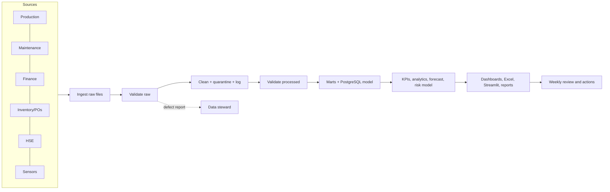
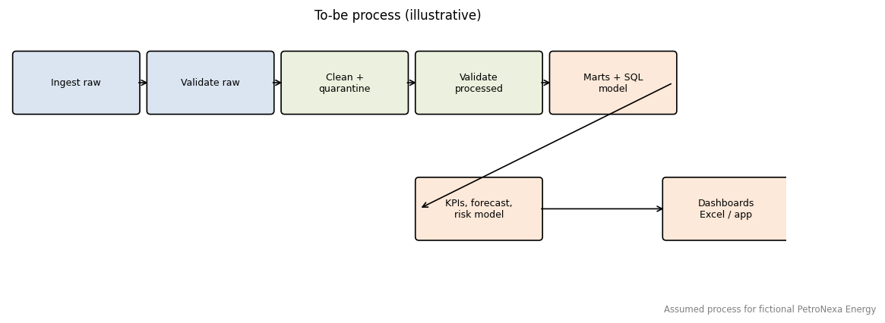

# Business Process - To Be

> All operational data in this project are synthetic. PetroNexa Energy is a FICTIONAL company; stakeholders and roles are illustrative assumptions.

## Changes versus as-is
| Area | To-be |
|---|---|
| Data model | One relational model with keys and a bridge table linking equipment to affected wells |
| Data quality | Automated checks before and after cleaning; quarantine instead of silent drops |
| KPIs | Single dictionary implemented identically in Python, SQL and BI measures |
| Loss valuation | Production loss valued with realised prices; downtime associated with maintenance events |
| Foresight | Backtested baseline forecast and a failure-risk ranking (moderate accuracy, stated) |
| Governance | Assumptions and limitations recorded in assumptions_and_constraints.md |

## RACI (assumed)
| Activity | Data Steward | Analyst | Ops/Maint Mgr | IT |
|---|---|---|---|---|
| KPI definitions | A | R | C | I |
| Pipeline operation | C | R | I | A |
| Dashboard review | I | R | A | C |
| Action follow-up | I | C | A/R | I |
